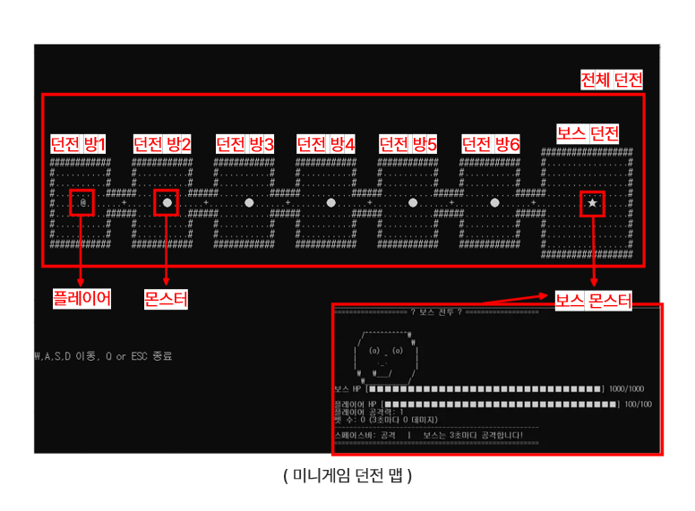

# C++을 활용한 종합 미니 게임

### Cpp_Dungeon_Memory에는 본인이 구현한 스테이지형 던전맵과 카드 짝 맞추기 게임이 포함됨
- 팀원들과 통합한 종합 미니 게임 (https://github.com/K-mjin/Cpp_Multi_Mini_Game_Project)
- 시연 영상 링크 (https://youtu.be/EZ0RBf4v_6M?si=joLbSCWfgXZ4W4lv)

## 프로젝트 소개
- 각 스테이지형 던전을 하나씩 통과하여 몬스터와 미니 게임을 한 후, 코인을 수집하여 던전 보스를 클리어하는 종합 미니 게임을 개발한 프로젝트.

## 프로젝트 개요
| 구분 | 내용 |
|------|------|
| 프로젝트 인원 | 4명 |
| 프로젝트 기간 | 25.08.20 ~ 25.08.22 |
| 담당 역할 | 전체 맵 구조 및 미니게임 구현 |

## 사용 기술
- **사용 언어** : C++
- **개발 환경** : Visual Studio

## 담당 역할
### 전체 던전 맵 구조 설계 및 몬스터 생성
- 던전 방 개수 기반 몬스터 자동 생성 로직 구현
- 던전 맵 벽 충돌 시 맵 밖으로 빠져나가지 않게 구현 및 이동 영역 구현
- 미니 게임 종료 후 맵 재구성 시 백업 방식 대신 맵 재생성 구조 설계 및 구현

### 이벤트 기반 상호작용 구현
- 플레이어가 몬스터 바로 앞으로 이동하여 스페이스바를 눌러 상호작용 시 대화가 나오고 미니게임 시작
- 플레이어가 순차적으로 던전 방을 통과하면서 몬스터를 만나면 미니게임이 시작되고 아닐 경우 다음 던전으로 진입을 제한하는 로직 구현

### 카드 짝 맞추기 미니 게임 구현
- 4X4 보드로 매 게임 시 카드 위치 랜덤으로 생성 및 초기화
- 각 알파벳마다 2개씩 카드 짝을 생성하고 같은 카드인지 비교 로직 구현
- 15턴 이하 8코인, 20턴 이하 5코인, 30턴 이하 2코인으로 턴 수 기반 보상 시스템 구현

## 실행화면
- 이미지를 클릭하면 시연영상이 재생됩니다.

